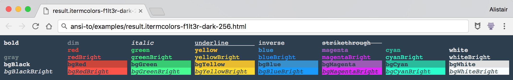
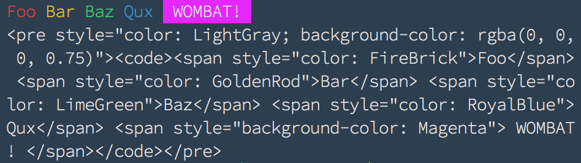
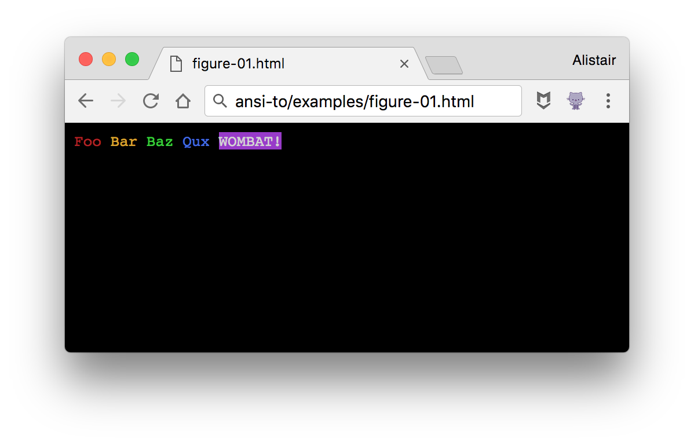
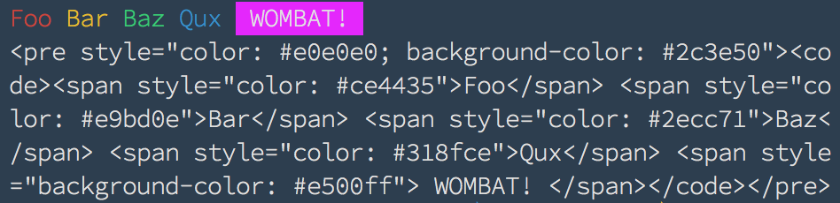
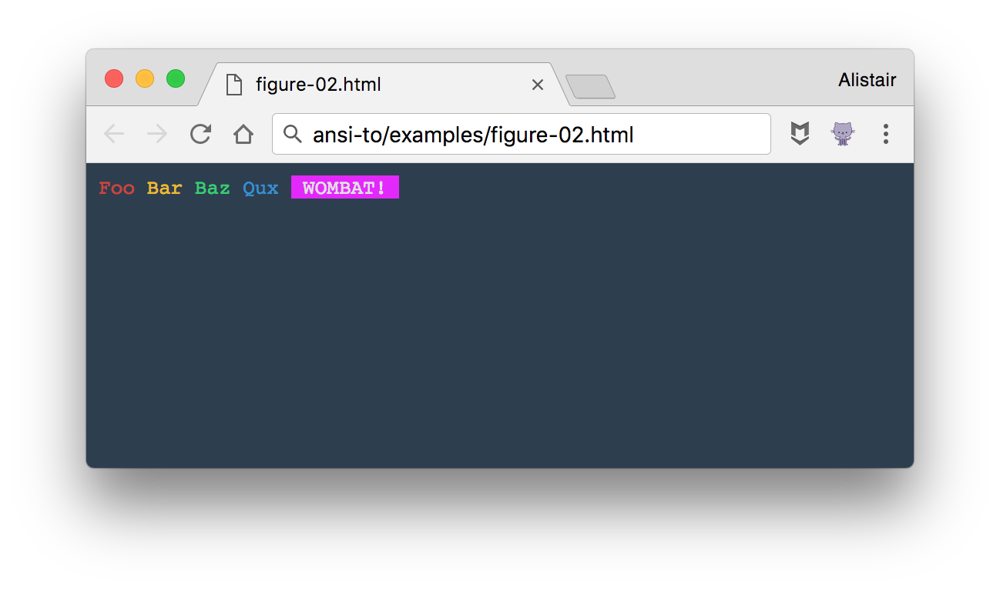

# ANSI-to

> 😹  export ANSI color strings to HTML, Image w/ iTerm2 color support

[](examples/ansi-to-html-lead-image-example-zoomed.png)

[](https://travis-ci.org/F1LT3R/ansi-to)
[](https://coveralls.io/github/F1LT3R/ansi-to?branch=master)
[](https://www.npmjs.com/package/ansi-to)
[](https://github.com/sindresorhus/xo)

**Features:**

- Convert to partial HTML for your blog
- Convert to Image for your README.md
- Designed for use with [Chalk](https://github.com/chalk/chalk)
- iTerm2 Preset support 
    + Eg: ANSI-to can load [`base16-tomorrow-night-256.itermcolors`](https://github.com/martinlindhe/base16-iterm2/blob/master/itermcolors/base16-tomorrow-night-256.itermcolors)
- Plugin architecture to add your own ANSI Parser
- Built-in default colors (HTML Color Names)
- Custom user-defined colors
- Custom user-defined container templates


## ANSI-to ... HTML

```js
const ansiTo = require('ansi-to')
const chalk = require('chalk')

const chalked = chalk`{red Foo} {yellow Bar} {green Baz} {blue Qux} {bgMagentaBright  WOMBAT! }`
console.log(chalked)

const html = ansiTo.html(chalked)
console.log(html)
```

Console Output:



Browser Screenshot:



## ANSI-to.load.iTerm2Colors

```js
const ansiTo = require('ansi-to')
const chalk = require('chalk')

const chalked = chalk`{red Foo} {yellow Bar} {green Baz} {blue Qux} {bgMagentaBright  WOMBAT! }`
console.log(chalked)

const iTerm2Colors = ansiTo.load.iTerm2Colors('./base16-flat-dark-f1lt3r-256.itermcolors')

const html = ansiTo.html(chalked, {colors: iTerm2Colors})
console.log(html)
```

Console Output:



Browser Screenshot:




## Install

```
$ yarn add ansi-to
```

