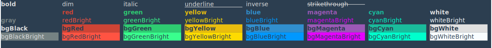

# ANSI-to

> 😹  export ANSI color strings to various formats: HTML, SVG, PNG.

ANSI-to takes a string of ANSI and converts it to various types of output.

For example, this SVG:

ANSI-to has the following plugins available:

- [SVG](https://github.com:F1LT3R/ansi-to-svg) - Export ANSI to Scalable Vector Graphics
- [<strike>HTML</strike>](https://github.com:F1LT3R/ansi-to-html) (coming soon)
- [<strike>PNG</strike>](https://github.com:F1LT3R/ansi-to-png) (coming soon)

Important: Do not use ANSI-to directly. Please use one of the above plugins.

**General Features**

- iTerm2 color support - [Base16 iTerm2 Color Schemes](https://github.com/martinlindhe/base16-iterm2)
- Use output in your `README.md` files
- Designed for use with [Chalk](https://github.com/chalk/chalk)
- Plugin architecture to build-your-own ANSI Parser
- Built-in default colors
- User can override colors
- Emoji support
- Powerline font support

## Why ANSI-to ?

ANSI-to is designed for use with ZTD development (Zero Technical Debt). ANSI-to provides a Markdown friendly way to include CLI output in your software documentation.

